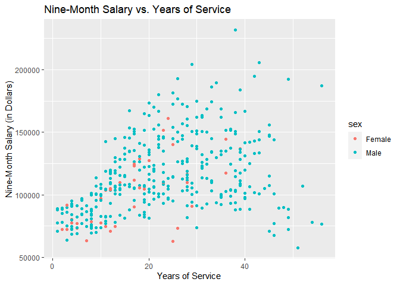
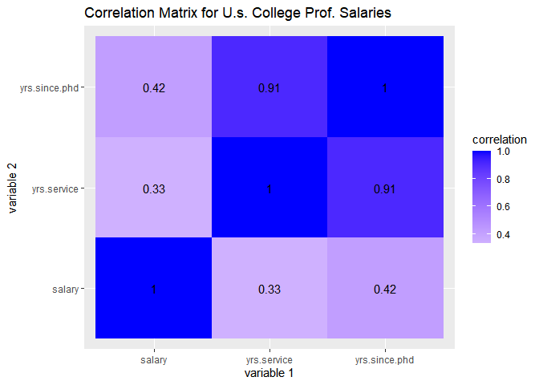
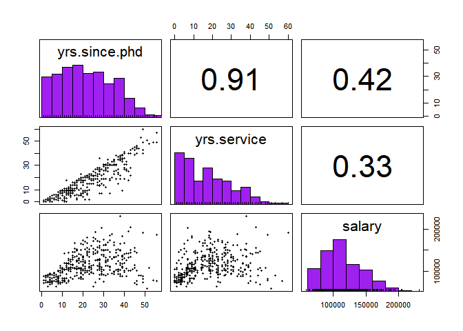
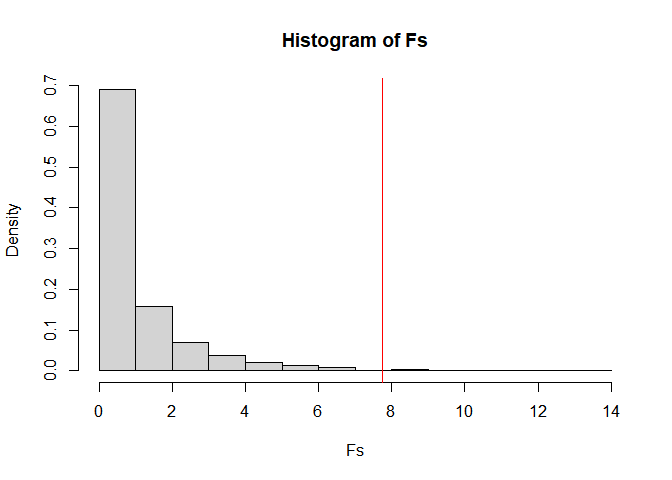
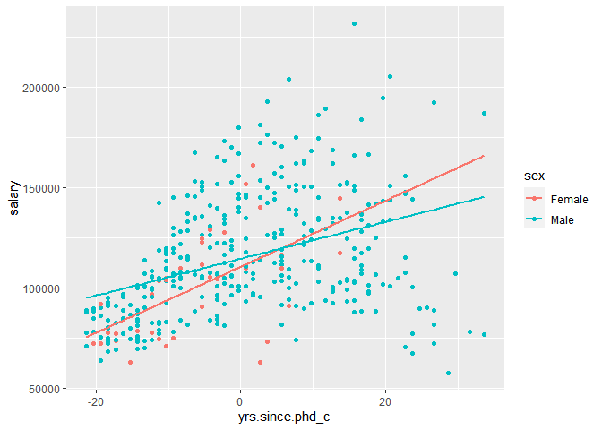
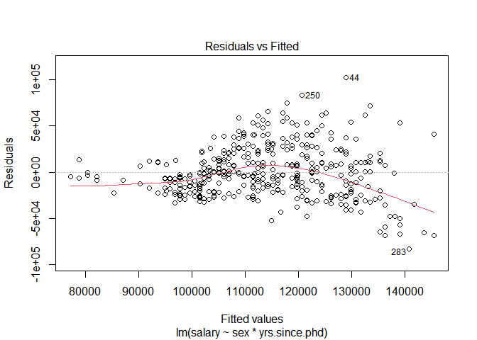
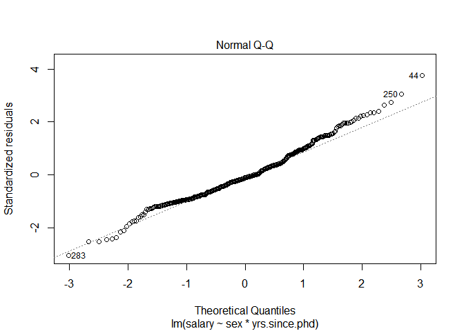
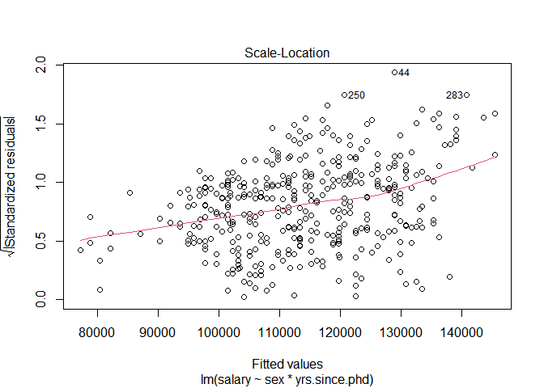
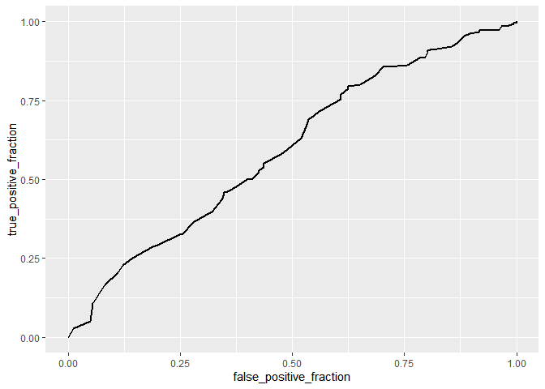

Project 2: An Analysis on Professors
================
Lupita Navarro
5/10/2021

------------------------------------------------------------------------

## An Analysis on College Professors

### 1: Introduction

##### For this project, I chose the data “Salaries,” found in the R package “carData.” “Salaries” consists of 397 observations collected in 2008/09 of the wages of Professors in the U.S., and includes 6 variables: rank (Assistant Professor, Associate Professor, or Professor), discipline (“A” if they teach theoritical departments; “B” for applied departments), yrs.since.phd (years sinxe PhD), yrs.service (years of service), sex (male or female), and salary (nine-month salary, in dollars).

##### I chose to explore this data because I am interested to see whether sex or years since PhD affect the wage levels of U.S. college professors. I am also excited to explore whether any correlation exists between discipline and other explanatory variables. I expect to find significant, positive correlations between both, years since PhD and salary, as well as between sex and salary, and no correlation for discipline and any variable. Fortunately, I did not have to tidy the dataset.

``` r
#peek the dataset
Salaries
```

    ##         rank discipline yrs.since.phd yrs.service    sex salary
    ## 1       Prof          B            19          18   Male 139750
    ## 2       Prof          B            20          16   Male 173200
    ## 3   AsstProf          B             4           3   Male  79750
    ## 4       Prof          B            45          39   Male 115000
    ## 5       Prof          B            40          41   Male 141500
    ## 6  AssocProf          B             6           6   Male  97000
    ## 7       Prof          B            30          23   Male 175000
    ## 8       Prof          B            45          45   Male 147765
    ## 9       Prof          B            21          20   Male 119250
    ## 10      Prof          B            18          18 Female 129000
    ## 11 AssocProf          B            12           8   Male 119800
    ## 12  AsstProf          B             7           2   Male  79800
    ## 13  AsstProf          B             1           1   Male  77700
    ## 14  AsstProf          B             2           0   Male  78000
    ## 15      Prof          B            20          18   Male 104800
    ## 16      Prof          B            12           3   Male 117150
    ##  [ reached 'max' / getOption("max.print") -- omitted 381 rows ]

``` r
#view number of observations
nrow(Salaries)
```

    ## [1] 397

``` r
#view columns
colnames(Salaries)
```

    ## [1] "rank"          "discipline"    "yrs.since.phd" "yrs.service"  
    ## [5] "sex"           "salary"

### 2: EDA

##### Explore your main variables by producing univariate/bivariate statistics and graphs. In particular, investigate relationships that you are going to test about with MANOVA and a randomization test, and variables included in your regression models. For example, you could create a correlation matrix with univariate/bivariate graphs and correlation coefficients.

####### I started off my analysis by exploring one of my relationships of interest: salaries, sex, and years since acquiring the PhD. I created a histogram to help visualize the relationship between the three.

``` r
#convert data to dataframe
salaries <- as.data.frame(Salaries)

#visualize the relationship first between two of my main variables
ggplot(salaries, aes(x = yrs.since.phd, y= salary, color = sex)) + 
  geom_point() +
  labs(x = "Years of Service", y = "Nine-Month Salary (in Dollars)",
       title = "Nine-Month Salary vs. Years of Service")
```



``` r
#find the correlation between salary and years of service
cor(salaries$yrs.since.phd, salaries$salary, use="pairwise.complete.obs")
```

    ## [1] 0.4192311

*From the histogram, I concluded that there does not seem to be a strong
relationship between salary and sex, nor between sex and years since
PhD. I also noted that the number of male professors was significantly
more than the number of female professors.The correlation test for
years.since.phd and salary came back as 0.419, further establishing that
the relationship between those two variables is not strong.*

####### To further my visual analysis, I created a correlation matrix between all of my numeric variables and created a heatmap.

``` r
#correlation matrix between all numeric variables
salaries_num <- salaries %>%
  select_if(is.numeric)
cor(salaries_num, use = "pairwise.complete.obs")
```

    ##               yrs.since.phd yrs.service    salary
    ## yrs.since.phd     1.0000000   0.9096491 0.4192311
    ## yrs.service       0.9096491   1.0000000 0.3347447
    ## salary            0.4192311   0.3347447 1.0000000

``` r
#graph the correlation matrix using a heatmap
cor(salaries_num, use = "pairwise.complete.obs") %>%
  #save as a  data frame
  as.data.frame %>%
  #convert row names to an explicit variable
  rownames_to_column %>%
  #pivot so that all correlations appear in the same column
  pivot_longer(-1, names_to = "other_var", values_to = "correlation") %>%
  ggplot(aes(rowname, other_var, fill = correlation)) +
  #heatmap with geom_tile
  geom_tile() +
  #change scale to make middle appear neutral
  scale_fill_gradient2(low="red", mid="white", high="blue") +
  #overlay values
  geom_text(aes(label = round(correlation, 2)), color = "black", size = 4) +
  #add title and labels
  labs(title = "Correlation Matrix for U.s. College Prof. Salaries", x =  "variable 1", y = "variable 2")
```



``` r
#build correlation matric with univariate and bivariate graphs
pairs.panels(salaries_num, 
             method = "pearson", #correlation coefficienct method
             hist.col = "purple", #color of histogram
             smooth = FALSE, density = FALSE, ellipses = FALSE)
```



*The correlation matrix, heatmap, and uni/bivariate graphs made it
easier to see that the only strong relationship between all numeric
variables is between years since PhD and years of service, correlation
coefficient= 0.91. The correlation coefficient between years since PhD
and salary, 0.42, shows a medium/weak relationship between the two,
while the correlation coefficient between years of service and salary,
0.33, shows that the relationship between the 2 variables is weak/low.*

### 3: MANOVA

##### Perform a MANOVA to test whether any of your numeric variables (or a subset of them, if including them all doesn’t make sense) show a mean difference across levels of one of your categorical variables.

``` r
#perform manova with 3 response variables: sex, years of service, and years since phd
manova_salaries <- manova(cbind(yrs.service, yrs.since.phd, salary) ~ sex, data= salaries)

#output of MANOVA
summary(manova_salaries)
```

    ##            Df   Pillai approx F num Df den Df   Pr(>F)   
    ## sex         1 0.032223   4.3618      3    393 0.004884 **
    ## Residuals 395                                            
    ## ---
    ## Signif. codes:  0 '***' 0.001 '**' 0.01 '*' 0.05 '.' 0.1 ' ' 1

*A one-way MANOVA was conducted to determine the effect of a professor’s
sex (female or male) on three dependent variables (years of service,
years since phd, and salary). Significant differences were found among
both sexes for at least one response variable (Pillai’s trace = 0.03,
pseudo F(3,393) = 4.3618, p&lt;0.05)*

####### The following are Anova tests:

``` r
#perform one-way ANOVA for each variable
summary.aov(manova_salaries)
```

    ##  Response yrs.service :
    ##              Df Sum Sq Mean Sq F value   Pr(>F)   
    ## sex           1   1583 1583.27  9.5622 0.002127 **
    ## Residuals   395  65403  165.58                    
    ## ---
    ## Signif. codes:  0 '***' 0.001 '**' 0.01 '*' 0.05 '.' 0.1 ' ' 1
    ## 
    ##  Response yrs.since.phd :
    ##              Df Sum Sq Mean Sq F value   Pr(>F)   
    ## sex           1   1456 1455.91  8.9424 0.002961 **
    ## Residuals   395  64310  162.81                    
    ## ---
    ## Signif. codes:  0 '***' 0.001 '**' 0.01 '*' 0.05 '.' 0.1 ' ' 1
    ## 
    ##  Response salary :
    ##              Df     Sum Sq    Mean Sq F value   Pr(>F)   
    ## sex           1 6.9800e+09 6980014930  7.7377 0.005667 **
    ## Residuals   395 3.5632e+11  902077538                    
    ## ---
    ## Signif. codes:  0 '***' 0.001 '**' 0.01 '*' 0.05 '.' 0.1 ' ' 1

``` r
#post-hoc analysis for yrs of service
pairwise.t.test(salaries$yrs.service, salaries$sex, p.adj="none")
```

    ## 
    ##  Pairwise comparisons using t tests with pooled SD 
    ## 
    ## data:  salaries$yrs.service and salaries$sex 
    ## 
    ##      Female
    ## Male 0.0021
    ## 
    ## P value adjustment method: none

``` r
#post-hoc analysis for yrs of service
pairwise.t.test(salaries$yrs.since.phd, salaries$sex, p.adj="none")
```

    ## 
    ##  Pairwise comparisons using t tests with pooled SD 
    ## 
    ## data:  salaries$yrs.since.phd and salaries$sex 
    ## 
    ##      Female
    ## Male 0.003 
    ## 
    ## P value adjustment method: none

``` r
#post-hoc analysis for yrs of service
pairwise.t.test(salaries$salary, salaries$sex, p.adj="none")
```

    ## 
    ##  Pairwise comparisons using t tests with pooled SD 
    ## 
    ## data:  salaries$salary and salaries$sex 
    ## 
    ##      Female
    ## Male 0.0057
    ## 
    ## P value adjustment method: none

*Univariate ANOVAs for each dependent variable were conducted as
follow-up tests to the MANOVA,and was significant for years of service
(F(1,395) = 9.5622, p&lt;0.05), years since phd (F(1,395) = 8.9424,
p&gt;0.05), salary (F(1,395) = 7.7377, p&lt;0.05).*

####### Type 1 error and Bonferroni statistics are calculated:

``` r
#calculate probability of at least one type 1 error
1-(.95)^5 #one test was conducted
```

    ## [1] 0.2262191

``` r
#bonferroni correction (adjust significance level)
0.05/5 
```

    ## [1] 0.01

*A post hoc analysis was performed conducting pairwise comparisons to
determine which sex differed in years of service, years since phd, and
salary. Both sexes were found to differ significantly from each other in
terms of years of service, years since phd, and salary after adjusting
for multiple comparisons (Bonferroni 𝛼=.01).The calculated probability
of a type 1 error is 0.23.*

### 4: Randomization Test

###### Perform a randomization test on your data (that makes sense and is interesting to look at). This can be anything you want!

``` r
#set seed
set.seed(348)

# Observed F-statistic, running anova
obs_F <- 7.7377

#randomization test (using replicate)
Fs <- replicate(5000,{
  # Randomly permute the response variable across doses
  new <- salaries %>%
    mutate(salary = sample(salary))
  # Compute variation within groups
  SSW <- new %>%
    group_by(sex) %>%
    summarize(SSW = sum((salary - mean(salary))^2)) %>%
    summarize(sum(SSW)) %>% 
    pull
  # Compute variation between groups
  SSB <- new %>% 
    mutate(mean = mean(salary)) %>%
    group_by(sex) %>% 
    mutate(groupmean = mean(salary)) %>%
    summarize(SSB = sum((mean - groupmean)^2)) %>%
    summarize(sum(SSB)) %>%
    pull
  # Compute the F-statistic (ratio of MSB and MSW)
  # df for SSB is 2 groups - 1 = 1
  # df for SSW is 397 observations - 2 groups = 395
  (SSB/1)/(SSW/395)
})

# Represent the distribution of the F-statistics for each randomized sample
hist(Fs, prob=T); abline(v = obs_F, col="red",add=T)
```



``` r
# Calculate the proportion of F statistic that are greater than the observed F-statistic
mean(Fs > obs_F)
```

    ## [1] 0.0068

``` r
#PERMANOVA Test
dists <- salaries %>% #compute the distances
  select(salary, yrs.since.phd) %>%
  dist
adonis(dists ~ sex, data = salaries)
```

    ## 
    ## Call:
    ## adonis(formula = dists ~ sex, data = salaries) 
    ## 
    ## Permutation: free
    ## Number of permutations: 999
    ## 
    ## Terms added sequentially (first to last)
    ## 
    ##            Df  SumsOfSqs    MeanSqs F.Model      R2 Pr(>F)   
    ## sex         1 6.9800e+09 6980016386  7.7377 0.01921  0.005 **
    ## Residuals 395 3.5632e+11  902077701         0.98079          
    ## Total     396 3.6330e+11                    1.00000          
    ## ---
    ## Signif. codes:  0 '***' 0.001 '**' 0.01 '*' 0.05 '.' 0.1 ' ' 1

*Null Hypothesis: The mean salary and yrs.since.phd do not significantly
differ by sex of a professor. Alt. Hypothesis:The mean salary and
yrs.since.phd do significantly differ by the sex of a college
professor.*

*The PERMANOVA test results show that we reject the null hypothesis,
meaning that salary and years since achieving a PhD do significantly
differ by sex of a college professor (p&lt;0.05).*

### 5: Linear Regression Model

##### Build a linear regression model predicting one of your numeric response variables from at least 2 explanatory variables, including their interaction.

``` r
#linear regression model for salary predicted by sex and years since phd
fit <- lm(salary ~ sex*yrs.since.phd, data = salaries)
summary(fit)
```

    ## 
    ## Call:
    ## lm(formula = salary ~ sex * yrs.since.phd, data = salaries)
    ## 
    ## Residuals:
    ##    Min     1Q Median     3Q    Max 
    ## -83012 -19442  -2988  15059 102652 
    ## 
    ## Coefficients:
    ##                       Estimate Std. Error t value Pr(>|t|)    
    ## (Intercept)            73840.8     8696.7   8.491 4.27e-16 ***
    ## sexMale                20209.6     9179.2   2.202 0.028269 *  
    ## yrs.since.phd           1644.9      454.6   3.618 0.000335 ***
    ## sexMale:yrs.since.phd   -728.0      468.0  -1.555 0.120665    
    ## ---
    ## Signif. codes:  0 '***' 0.001 '**' 0.01 '*' 0.05 '.' 0.1 ' ' 1
    ## 
    ## Residual standard error: 27420 on 393 degrees of freedom
    ## Multiple R-squared:  0.1867, Adjusted R-squared:  0.1805 
    ## F-statistic: 30.07 on 3 and 393 DF,  p-value: < 2.2e-16

``` r
#center the data around the mean
salaries$yrs.since.phd_c <- salaries$yrs.since.phd - mean(salaries$yrs.since.phd)

#include an interaction term in the regression model with centered numerical predictors
fit_c <- lm(salary ~ sex*yrs.since.phd_c, data= salaries)
summary(fit_c)
```

    ## 
    ## Call:
    ## lm(formula = salary ~ sex * yrs.since.phd_c, data = salaries)
    ## 
    ## Residuals:
    ##    Min     1Q Median     3Q    Max 
    ## -83012 -19442  -2988  15059 102652 
    ## 
    ## Coefficients:
    ##                         Estimate Std. Error t value Pr(>|t|)    
    ## (Intercept)             110546.1     5122.0  21.582  < 2e-16 ***
    ## sexMale                   3964.8     5323.6   0.745 0.456860    
    ## yrs.since.phd_c           1644.9      454.6   3.618 0.000335 ***
    ## sexMale:yrs.since.phd_c   -728.0      468.0  -1.555 0.120665    
    ## ---
    ## Signif. codes:  0 '***' 0.001 '**' 0.01 '*' 0.05 '.' 0.1 ' ' 1
    ## 
    ## Residual standard error: 27420 on 393 degrees of freedom
    ## Multiple R-squared:  0.1867, Adjusted R-squared:  0.1805 
    ## F-statistic: 30.07 on 3 and 393 DF,  p-value: < 2.2e-16

``` r
#graph to visualize interaction between 2 variables on the response
ggplot(salaries, aes(x= yrs.since.phd_c, y = salary, color= sex)) +
  geom_point() +
  geom_smooth(method = lm, se= FALSE, fullrange= TRUE)
```



``` r
#proportion of the variation explained by model
summary(fit)$r.sq
```

    ## [1] 0.1867042

``` r
#linearity assumption
plot(fit, which = 1)
```



``` r
#normality assumptions
plot(fit, which= 2)
```



``` r
#homoscedasticity
plot(fit, which = 3)
```



``` r
bptest(fit)
```

    ## 
    ##  studentized Breusch-Pagan test
    ## 
    ## data:  fit
    ## BP = 52.025, df = 3, p-value = 2.958e-11

``` r
#uncorrected standard errors
summary(fit)$coef
```

    ##                         Estimate Std. Error   t value     Pr(>|t|)
    ## (Intercept)           73840.7607  8696.7132  8.490651 4.269694e-16
    ## sexMale               20209.6135  9179.2131  2.201672 2.826898e-02
    ## yrs.since.phd          1644.8825   454.6163  3.618177 3.354005e-04
    ## sexMale:yrs.since.phd  -727.9822   468.0468 -1.555362 1.206648e-01

``` r
#robust standard error
coeftest(fit, vcov = vcovHC(fit))
```

    ## 
    ## t test of coefficients:
    ## 
    ##                       Estimate Std. Error t value  Pr(>|t|)    
    ## (Intercept)           73840.76    3999.23 18.4638 < 2.2e-16 ***
    ## sexMale               20209.61    4825.12  4.1884 3.471e-05 ***
    ## yrs.since.phd          1644.88     302.98  5.4290 9.940e-08 ***
    ## sexMale:yrs.since.phd  -727.98     331.21 -2.1979   0.02854 *  
    ## ---
    ## Signif. codes:  0 '***' 0.001 '**' 0.01 '*' 0.05 '.' 0.1 ' ' 1

``` r
#Bootstrap standard errors
# Use the function replicate to repeat the process (similar to a for loop)
samp_SEs <- replicate(5000, {
  # Bootstrap your data (resample observations)
  boot_data <- sample_frac(salaries, replace = TRUE)
  # Fit regression model
  fitboot <- lm(salary ~ sex*yrs.since.phd_c, data = salaries)
  # Save the coefficients
  coef(fitboot)
  })
```

*Assumptions: Linearity assumption is relatively met, the normality
assumption is met, and homoscedasticity appears to not be met.*

*Salary (dollars) = 73,840.8 + 20,209.6(if Male) + 1,644.9 (per year
since phd) - 728(male)(yrs.since.phd). The predicted baseline of salary
is 73,840 dollars; If male, the salary increase by about $20,209; For
every year since the college professor got their PhD, the salary
increases by about 1,644 dollars.The effect on salary by gender:male
decreases by about 728 dollars based on the effect of years since
getting the PhD. Only years since PhD is significant in determining the
salary (p&lt;0.05). Only about 18.7% of our our variation is explained
by the regression model.*

*Recomputing the regression with robust sE fails to have any significant
changes on the results of the regression. The only difference is lower
standard errors, but gender and years since PhD still insignificantly
affect the salary of college professors.*

### 6: Logistic Regression

###### Build a logistic regression model predicting a binary categorical variable (if you don’t have one, create one based on another variable or combination of other variables) from at least 2 explanatory variables (interaction is not necessary).

###### Interpret coefficient estimates in context (regardless of significance).

``` r
# create a binary variable coded as 0 and 1 
salaries <- salaries %>%
  mutate(y= ifelse(discipline== "B", 1, 0))

#take a peek
head(salaries)
```

    ##        rank discipline yrs.since.phd yrs.service  sex salary yrs.since.phd_c y
    ## 1      Prof          B            19          18 Male 139750       -3.314861 1
    ## 2      Prof          B            20          16 Male 173200       -2.314861 1
    ## 3  AsstProf          B             4           3 Male  79750      -18.314861 1
    ## 4      Prof          B            45          39 Male 115000       22.685139 1
    ## 5      Prof          B            40          41 Male 141500       17.685139 1
    ## 6 AssocProf          B             6           6 Male  97000      -16.314861 1

``` r
#logistic regression model
fit1<- glm(y ~ yrs.service + sex, data = salaries, family = "binomial")
summary(fit1)
```

    ## 
    ## Call:
    ## glm(formula = y ~ yrs.service + sex, family = "binomial", data = salaries)
    ## 
    ## Deviance Residuals: 
    ##     Min       1Q   Median       3Q      Max  
    ## -1.4711  -1.2131   0.9297   1.0950   1.5874  
    ## 
    ## Coefficients:
    ##              Estimate Std. Error z value Pr(>|z|)   
    ## (Intercept)  0.462845   0.336731   1.375    0.169   
    ## yrs.service -0.026577   0.008078  -3.290    0.001 **
    ## sexMale      0.205487   0.345229   0.595    0.552   
    ## ---
    ## Signif. codes:  0 '***' 0.001 '**' 0.01 '*' 0.05 '.' 0.1 ' ' 1
    ## 
    ## (Dispersion parameter for binomial family taken to be 1)
    ## 
    ##     Null deviance: 547.27  on 396  degrees of freedom
    ## Residual deviance: 536.10  on 394  degrees of freedom
    ## AIC: 542.1
    ## 
    ## Number of Fisher Scoring iterations: 4

``` r
#based on predicted probability
salaries$prob1 <- predict(fit1, type = "response")

# classify in a clump by male or not
salaries$predicted <- ifelse(salaries$prob1 > 0.5, "B", "A")

#confusion matrix
table(true_condition = salaries$discipline, predicted_condition = salaries$predicted)
```

    ##               predicted_condition
    ## true_condition   A   B
    ##              A  68 113
    ##              B  46 170

``` r
#compute accuracy
(68 + 170)/397
```

    ## [1] 0.5994962

``` r
#compute sensitivity
170/216
```

    ## [1] 0.787037

``` r
#compute specificity
68/181
```

    ## [1] 0.3756906

``` r
#ppv
170/283
```

    ## [1] 0.6007067

``` r
# plot roc curve
ROCplot <- ggplot(salaries) + 
  geom_roc(aes(d= y, m= prob1), n.cuts = 0)

#view plot
ROCplot
```



``` r
#calculate AUC
calc_auc(ROCplot)
```

    ##   PANEL group       AUC
    ## 1     1    -1 0.5933983

*The accuracy for our confusion matrix is .60, the sensitivity is .79,
and the specificity is .38.*

*Probability that Discipline is an Applied Department (B) = 0.463 -
.027(per year of service) + .205 (if Male). The probability that a
professor teachers at an “applied” department of college is baseline
.463, decreases by .027 per year of service, and increases by .205 if
the professor is male. The logistic regression give us significant
results, indicating that only years of service significantly affects
what discipline the professor is likely to teach (p &lt;0.05).*

*The AUC, 0.593, indicates that 59.3% of the time, male professors have
a higher probability of teaching “applied” departments (“B”), regardless
of years of service.*

------------------------------------------------------------------------

    ##        sysname        release        version       nodename        machine 
    ##      "Windows"       "10 x64"  "build 19042"   "GISELLESPC"       "x86-64" 
    ##          login           user effective_user 
    ##       "Lupita"       "Lupita"       "Lupita"
